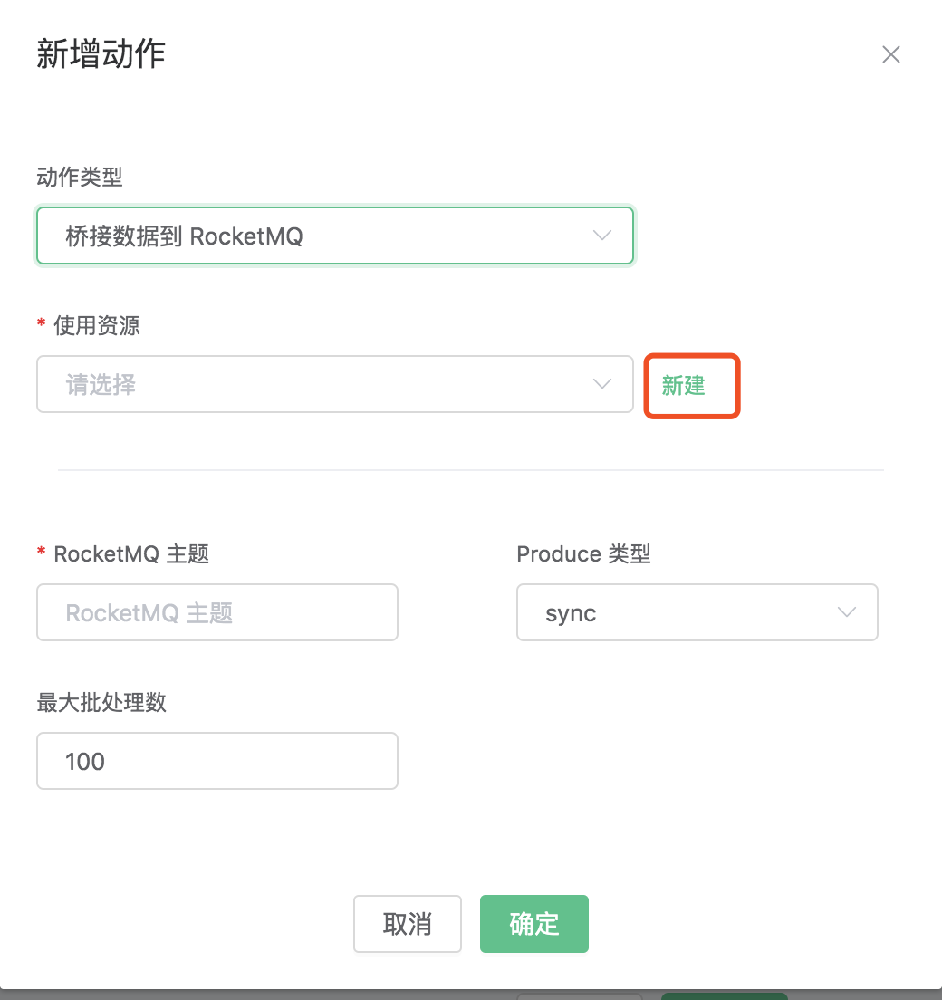
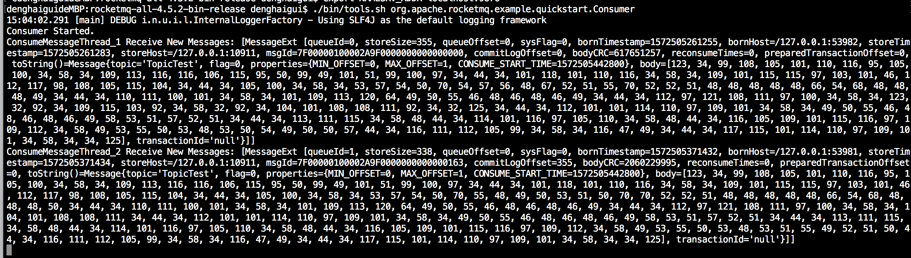
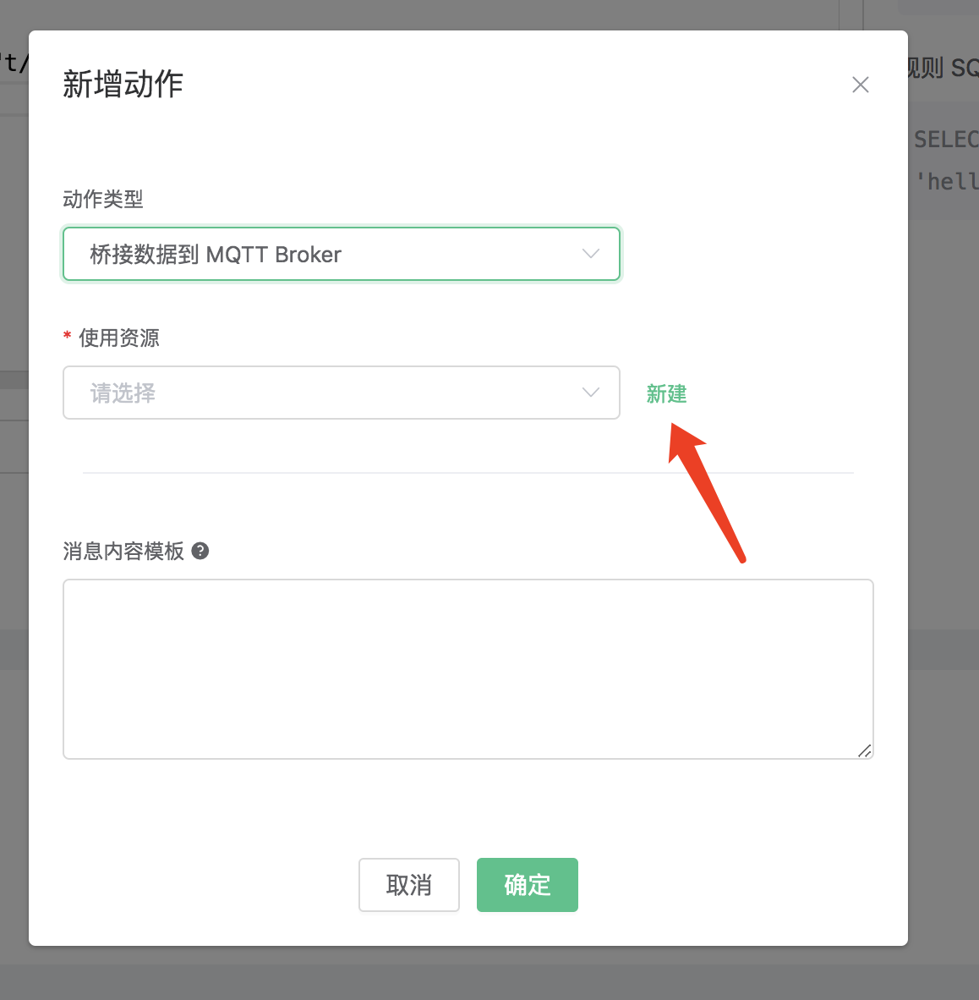
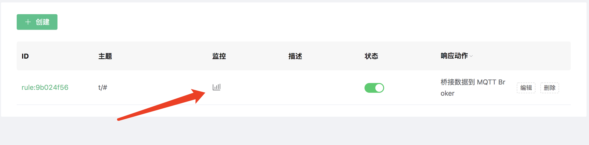

# 桥接数据到 MQTT Broker

## 桥接数据到 MQTT Broker

搭建 MQTT Broker 环境，以 MacOS X 为例:

```bash
$ brew install mosquitto

启动 mosquitto
$ mosquitto
```

创建规则:

打开 [EMQ X Dashboard](http://127.0.0.1:18083/#/rules)，选择左侧的 “规则” 选项卡。

填写规则 SQL:

```sql
SELECT * FROM "t/#"
```


关联动作:

在 “响应动作” 界面选择 “添加”，然后在 “动作” 下拉框里选择 “桥接数据到 MQTT Broker”。


填写动作参数:

"桥接数据到 MQTT Broker" 动作只需要一个参数：

关联资源。现在资源下拉框为空，可以点击右上角的 “新建资源” 来创建一个 MQTT Bridge 资源:


选择 MQTT Bridge 资源,填写资源配置:

填写真实的 mosquitto 服务器地址，其他配置保持默认值，然后点击 “测试连接” 按钮，确保连接测试成功。

最后点击 “新建” 按钮。


返回响应动作界面，点击 “确认”。


返回规则创建界面，点击 “新建”。


规则已经创建完成，现在发一条数据:

```bash
Topic: "t/1"

QoS: 0

Payload: "Hello, World\!"
```

然后通过 mqtt 客户端查看消息是否发布成功


在规则列表里，可以看到刚才创建的规则的命中次数已经增加了 1:


## 桥接数据到 Kafka

搭建 Kafka 环境，以 MacOS X 为例:

```bash
$ wget http://apache.claz.org/kafka/2.3.0/kafka_2.12-2.3.0.tgz

$ tar -xzf  kafka_2.12-2.3.0.tgz

$ cd kafka_2.12-2.3.0

# 启动 Zookeeper
$ ./bin/zookeeper-server-start.sh config/zookeeper.properties
# 启动 Kafka
$ ./bin/kafka-server-start.sh config/server.properties
```

创建 Kafka ​ 的主题:

```bash
$ ./bin/kafka-topics.sh --zookeeper localhost:2181 --replication-factor 1 --partitions 1 --topic testTopic --create
```


创建 Kafka Rule 之前必须先在 Kafka 中创建好主题，否则创建 Kafka Rule 失败。


创建规则:

打开 [EMQ X Dashboard](http://127.0.0.1:18083/#/rules)，选择左侧的 “规则” 选项卡。

填写规则 SQL:

```sql
SELECT * FROM "t/#"
```


关联动作:

在 “响应动作” 界面选择 “添加”，然后在 “动作” 下拉框里选择 “桥接数据到 Kafka”。


填写动作参数:

“保存数据到 Kafka 动作需要两个参数：

1\). Kafka 的消息主题

2\). 关联资源。现在资源下拉框为空，可以点击右上角的 “新建资源” 来创建一个 Kafka 资源:


选择 Kafka 资源”。

填写资源配置:

填写真实的 Kafka 服务器地址，多个地址用,分隔，其他配置保持默认值，然后点击 “测试连接” 按钮，确保连接测试成功。

最后点击 “新建” 按钮。


返回响应动作界面，点击 “确认”。


返回规则创建界面，点击 “新建”。


规则已经创建完成，现在发一条数据:

```bash
Topic: "t/1"

QoS: 0

Payload: "hello"
```

然后通过 Kafka 命令去查看消息是否生产成功:

```bash
$ ./bin/kafka-console-consumer.sh --bootstrap-server 127.0.0.1:9092  --topic testTopic --from-beginning
```


在规则列表里，可以看到刚才创建的规则的命中次数已经增加了 1:


## 桥接数据到 Pulsar

搭建 Pulsar 环境，以 MacOS X 为例:

```bash
$ wget http://apache.mirrors.hoobly.com/pulsar/pulsar-2.3.2/apache-pulsar-2.3.2-bin.tar.gz

$ tar xvfz apache-pulsar-2.3.2-bin.tar.gz

$ cd apache-pulsar-2.3.2

# 启动 Pulsar
$ ./bin/pulsar standalone
```

创建 Pulsar 的主题:

```bash
$ ./bin/pulsar-admin topics create-partitioned-topic -p 5 testTopic
```

创建规则:

打开 [EMQ X Dashboard](http://127.0.0.1:18083/#/rules)，选择左侧的 “规则” 选项卡。

填写规则 SQL:

```bash
SELECT * FROM "t/#"
```


关联动作:

在 “响应动作” 界面选择 “添加”，然后在 “动作” 下拉框里选择 “桥接数据到 Pulsar”。


填写动作参数:

“保存数据到 Pulsar 动作需要两个参数：

1\). Pulsar 的消息主题

2\). 关联资源。现在资源下拉框为空，可以点击右上角的 “新建资源” 来创建一个 Pulsar 资源:


选择 Pulsar 资源”。

填写资源配置:

填写真实的 Pulsar 服务器地址，多个地址用,分隔，其他配置保持默认值，然后点击 “测试连接” 按钮，确保连接测试成功。

最后点击 “新建” 按钮。


返回响应动作界面，点击 “确认”。


返回规则创建界面，点击 “新建”。


规则已经创建完成，现在发一条数据:

```bash
Topic: "t/1"

QoS: 0

Payload: "hello"
```

然后通过 Pulsar 命令去查看消息是否生产成功:

```bash
$ ./bin/pulsar-client consume testTopic  -s "sub-name" -n 1000
```


在规则列表里，可以看到刚才创建的规则的命中次数已经增加了 1:


## 桥接数据到 RabbitMQ

搭建 RabbitMQ 环境，以 MacOS X 为例:

```bash
$ brew install rabbitmq

# 启动 rabbitmq
$ rabbitmq-server
```

创建规则:

打开 [EMQ X Dashboard](http://127.0.0.1:18083/#/rules)，选择左侧的 “规则” 选项卡。

填写规则 SQL:

```sql
SELECT * FROM "t/#"
```


关联动作:

在 “响应动作” 界面选择 “添加”，然后在 “动作” 下拉框里选择 “桥接数据到 RabbitMQ”。


填写动作参数:

“桥接数据到 RabbitMQ 动作需要四个参数：

1\). RabbitMQ Exchange。这个例子里我们设置 Exchange 为 "messages"，

2\). RabbitMQ Exchange Type。这个例子我们设置 Exchange Type 为 "topic"

3\). RabbitMQ Routing Key。这个例子我们设置 Routing Key 为 "test"

4\). 关联资源。现在资源下拉框为空，可以点击右上角的 “新建资源” 来创建一个 RabbitMQ 资源:


选择 RabbitMQ 资源。

填写资源配置:

填写真实的 RabbitMQ 服务器地址，其他配置保持默认值，然后点击 “测试连接” 按钮，确保连接测试成功。

最后点击 “新建” 按钮。


返回响应动作界面，点击 “确认”。


返回规则创建界面，点击 “新建”。


规则已经创建完成，现在发一条数据:

```bash
Topic: "t/1"

QoS: 0

Payload: "Hello, World\!"
```

编写 amqp 协议的客户端，以下是用 python 写的 amqp 客户端的示例代码:

```python
#!/usr/bin/env python
import pika

connection = pika.BlockingConnection(
    pika.ConnectionParameters(host='localhost'))
channel = connection.channel()

channel.exchange_declare(exchange='messages', exchange_type='topic')

result = channel.queue_declare(queue='', exclusive=True)
queue_name = result.method.queue

channel.queue_bind(exchange='messages', queue=queue_name, routing_key='test')

print('[*] Waiting for messages. To exit press CTRL+C')

def callback(ch, method, properties, body):
    print(" [x] %r" % body)

channel.basic_consume(
    queue=queue_name, on_message_callback=callback, auto_ack=True)

channel.start_consuming()
```

然后通过 amqp 协议的客户端查看消息是否发布成功, 以下是


在规则列表里，可以看到刚才创建的规则的命中次数已经增加了 1:


## 桥接数据到 RocketMQ

搭建 RocketMQ 环境，以 MacOS X ​ 为例:

```bash
$ wget http://mirror.metrocast.net/apache/rocketmq/4.5.2/rocketmq-all-4.5.2-bin-release.zip

$ unzip rocketmq-all-4.5.2-bin-release.zip

$ cd rocketmq-all-4.5.2-bin-release

# 在conf/broker.conf添加了2个配置
brokerIP1 = 127.0.0.1
autoCreateTopicEnable = true

# 启动 RocketMQ NameServer
$ ./bin/mqnamesrv

# 启动 RocketMQ Broker
$ ./bin/mqbroker -n localhost:9876 -c conf/broker.conf
```

创建规则:

打开 [EMQ X Dashboard](http://127.0.0.1:18083/#/rules)，选择左侧的 “规则” 选项卡。

填写规则 SQL:

```sql
SELECT * FROM "t/#"
```


关联动作:

在 “响应动作” 界面选择 “添加”，然后在 “动作” 下拉框里选择 “桥接数据到 RocketMQ”。


填写动作参数:

“保存数据到 RocketMQ 动作需要两个参数：

1\). RocketMQ 的消息主题

2\). 关联资源。现在资源下拉框为空，可以点击右上角的 “新建资源” 来创建一个 RocketMQ 资源:



填写资源配置:

填写真实的 RocketMQ 服务器地址，多个地址用,分隔，其他配置保持默认值，然后点击 “测试连接” 按钮，确保连接测试成功。

最后点击 “新建” 按钮。


返回响应动作界面，点击 “确认”。


返回规则创建界面，点击 “新建”。


规则已经创建完成，现在发一条数据:

```bash
Topic: "t/1"

QoS: 0

Payload: "hello"
```

然后通过 RocketMQ 命令去查看消息是否生产成功:

```bash
$ ./bin/tools.sh org.apache.rocketmq.example.quickstart.Consumer TopicTest
```



在规则列表里，可以看到刚才创建的规则的命中次数已经增加了 1:


## 桥接数据到 MQTT Broker

搭建 MQTT Broker 环境，以 MacOS X 为例:

```bash
$ brew install mosquitto

启动 mosquitto
$ mosquitto
```

创建规则:

打开 [EMQ X Dashboard](http://127.0.0.1:18083/#/rules)，选择左侧的 “规则” 选项卡。

填写规则 SQL:

```sql
SELECT * FROM "t/#"
```


关联动作:

在 “响应动作” 界面选择 “添加”，然后在 “动作” 下拉框里选择 “桥接数据到 MQTT Broker”。


填写动作参数:

"桥接数据到 MQTT Broker" 动作只需要一个参数：

关联资源。现在资源下拉框为空，可以点击右上角的 “新建资源” 来创建一个 MQTT Bridge 资源:


选择 MQTT Bridge 资源,填写资源配置:

填写真实的 mosquitto 服务器地址，其他配置保持默认值，然后点击 “测试连接” 按钮，确保连接测试成功。

最后点击 “新建” 按钮。


返回响应动作界面，点击 “确认”。


返回规则创建界面，点击 “新建”。


规则已经创建完成，现在发一条数据:

```bash
Topic: "t/1"

QoS: 0

Payload: "Hello, World\!"
```

然后通过 mqtt 客户端查看消息是否发布成功


在规则列表里，可以看到刚才创建的规则的命中次数已经增加了 1:


## 桥接数据到 RPC 服务

搭建 EMQ X Broker 环境，以 MacOS X 为例:

```bash
$ brew tap emqx/emqx/emqx

$ brew install emqx

# 启动 emqx
$ emqx console
```

创建规则:

打开 [EMQ X Dashboard](http://127.0.0.1:18083/#/rules)，选择左侧的 “规则” 选项卡。

填写规则 SQL:

```sql
SELECT * FROM "t/#"
```


关联动作:

在 “响应动作” 界面选择 “添加”，然后在 “动作” 下拉框里选择 “桥接数据到 MQTT Broker”。


填写动作参数:

桥接数据到 MQTT Broker 动作只需要一个参数：

关联资源。现在资源下拉框为空，可以点击右上角的 “新建资源” 来创建一个 RPC Bridge 资源:



选择 RPC Bridge 资源。

填写资源配置:

填写真实的 emqx 节点名，其他配置保持默认值，然后点击 “测试连接” 按钮，确保连接测试成功。

最后点击 “新建” 按钮。


返回响应动作界面，点击 “确认”。


返回规则创建界面，点击 “新建”。


规则已经创建完成，现在发一条数据:

```bash
Topic: "t/1"

QoS: 0

Payload: "Hello, World\!"
```

然后通过 mqtt 客户端查看消息是否发布成功


在规则列表里，可以看到刚才创建的规则的命中次数已经增加了 1:



