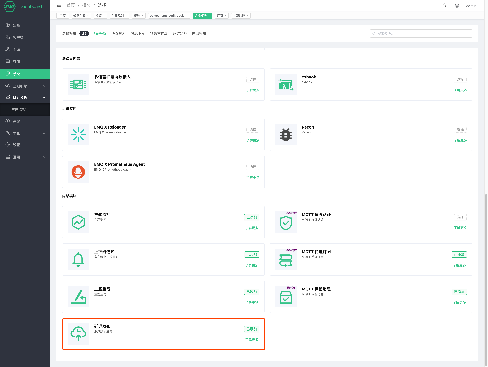

# MQTT 消息延迟发布

## 创建模块

打开 [EMQ X Dashboard](http://127.0.0.1:18083/#/modules)，点击左侧的 “模块” 选项卡，选择添加：


选择延迟发布模块，无需配置参数，直接开启



## 延迟发布简介

EMQ X 的延迟发布功能可以实现按照用户配置的时间间隔延迟发布 PUBLISH 报文的功能。当客户端使用特殊主题前缀 `$delayed/{DelayInteval}` 发布消息到 EMQ X 时，将触发延迟发布功能。

延迟发布主题的具体格式如下：

```bash
$delayed/{DelayInterval}/{TopicName}
```

* `$delayed`: 使用 `$delay` 作为主题前缀的消息都将被视为需要延迟发布的消息。延迟间隔由下一主题层级中的内容决定。
* `{DelayInterval}`: 指定该 MQTT 消息延迟发布的时间间隔，单位是秒，允许的最大间隔是 4294967 秒。如果 `{DelayInterval}` 无法被解析为一个整型数字，EMQ X 将丢弃该消息，客户端不会收到任何信息。
* `{TopicName}`: MQTT 消息的主题名称。

例如:

* `$delayed/15/x/y`: 15 秒后将 MQTT 消息发布到主题 `x/y`。
* `$delayed/60/a/b`: 1 分钟后将 MQTT 消息发布到 `a/b`。
* `$delayed/3600/$SYS/topic`: 1 小时后将 MQTT 消息发布到 `$SYS/topic`。

