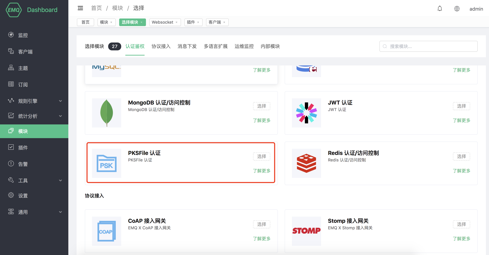
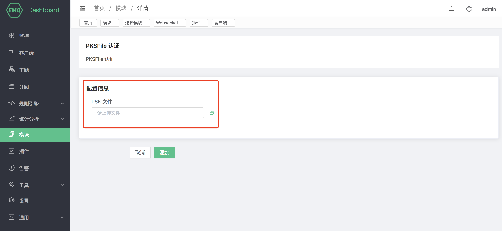
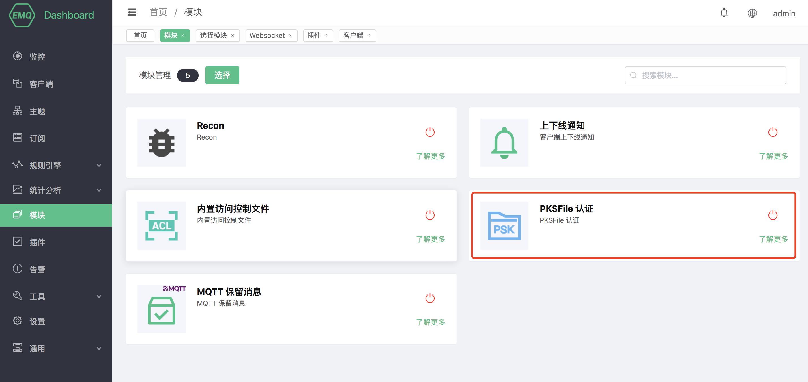

# PKSFile 认证

如果希望使用 PSK 认证，需要将 [TLS 认证](psk_authentication.md#auth-tls) 中的 `listener.ssl.external.ciphers` 注释掉，然后配置 `listener.ssl.external.psk_ciphers`：

```bash
#listener.ssl.external.ciphers = ECDHE-ECDSA-AES256-GCM-SHA384,...
listener.ssl.external.psk_ciphers = PSK-AES128-CBC-SHA,PSK-AES256-CBC-SHA,PSK-3DES-EDE-CBC-SHA,PSK-RC4-SHA
```

## 创建模块

打开 [EMQ X Dashboard](http://127.0.0.1:18083/#/modules)，点击左侧的 “模块” 选项卡，选择添加：


选择 PSK 认证



配置相关参数



点击添加后，模块添加完成



PSK 的配置文件为 `psk.txt`，使用冒号`:` 分隔 PSK ID 和 PSK：

```bash
client1:1234
client2:abcd
```

