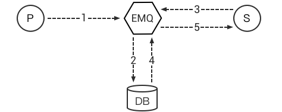
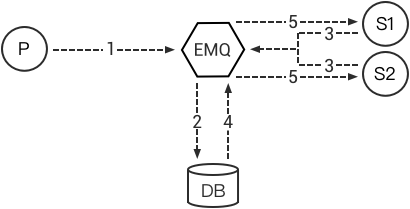

# 数据存储设计

数据存储的主要使用场景包括将客户端上下线状态，订阅主题信息，消息内容，消息抵达后发送消息回执等操作记录到 Redis、MySQL、PostgreSQL、MongoDB、Cassandra 等各种数据库中。用户也可以通过订阅相关主题的方式来实现类似的功能，但是在企业版中内置了对这些持久化的支持；相比于前者，后者的执行效率更高，也能大大降低开发者的工作量。

  数据存储是 EMQ X Enterprise 专属功能。 

## 数据存储设计

### 一对一消息存储

1. Publish 端发布一条消息；
2. Backend 将消息记录数据库中；
3. Subscribe 端订阅主题；
4. Backend 从数据库中获取该主题的消息；
5. 发送消息给 Subscribe 端；
6. Subscribe 端确认后 Backend 从数据库中移除该消息；

### 一对多消息存储

1. Publish 端发布一条消息；
2. Backend 将消息记录在数据库中；
3. Subscribe1 和 Subscribe2 订阅主题；
4. Backend 从数据库中获取该主题的消息；
5. 发送消息给 Subscribe1 和 Subscribe2；
6. Backend 记录 Subscribe1 和 Subscribe2 已读消息位置，下次获取消息从该位置开始。

### 客户端在线状态存储

支持将设备上下线状态，直接存储到 Redis 或数据库。

### 客户端代理订阅

支持代理订阅功能，设备客户端上线时，由存储模块直接从数据库，代理加载订阅主题。

### 存储插件列表

EMQ X 支持 MQTT 消息直接存储 Redis、MySQL、PostgreSQL、MongoDB、Cassandra、DynamoDB、InfluxDB、OpenTSDB 数据库:

| 存储插件 | 配置文件 | 说明 |
| :--- | :--- | :--- |
| emqx\_backend\_redis | emqx\_backend\_redis.conf | Redis 消息存储 |
| emqx\_backend\_mysql | emqx\_backend\_mysql.conf | MySQL 消息存储 |
| emqx\_backend\_pgsql | emqx\_backend\_pgsql.conf | PostgreSQL 消息存储 |
| emqx\_backend\_mongo | emqx\_backend\_mongo.conf | MongoDB 消息存储 |
| emqx\_backend\_cassa | emqx\_backend\_cassa.conf | Cassandra 消息存储 |
| emqx\_backend\_dynamo | emqx\_backend\_dynamo.conf | DynamoDB 消息存储 |
| emqx\_backend\_influxdb | emqx\_backend\_influxdb.conf | InfluxDB 消息存储 |
| emqx\_backend\_opentsdb | emqx\_backend\_opentsdb.conf | OpenTSDB 消息存储 |

### 配置步骤

EMQ X 中支持不同类型的数据库的持久化，虽然在一些细节的配置上有所不同，但是任何一种类型的持久化配置主要做两步操作：

* 数据源连接配置：这部分主要用于配置数据库的连接信息，包括服务器地址，数据库名称，以及用户名和密码等信息，针对每种不同的数据库，这部分配置可能会有所不同；
* 事件注册与行为：根据不同的事件，你可以在配置文件中配置相关的行为（action），相关的行为可以是函数，也可以是SQL语句。

