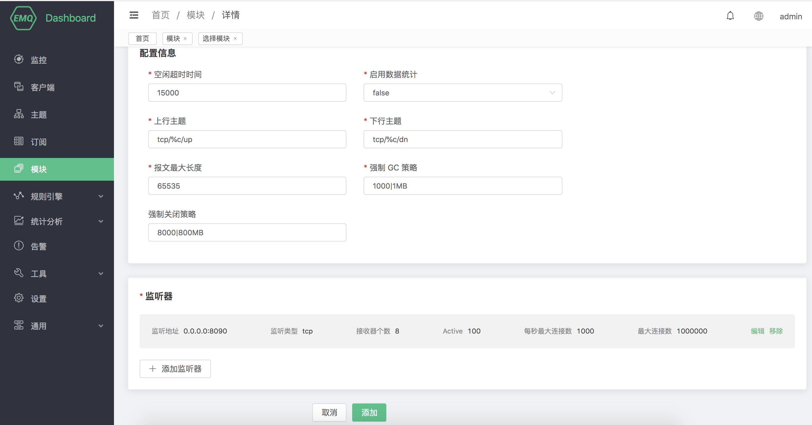
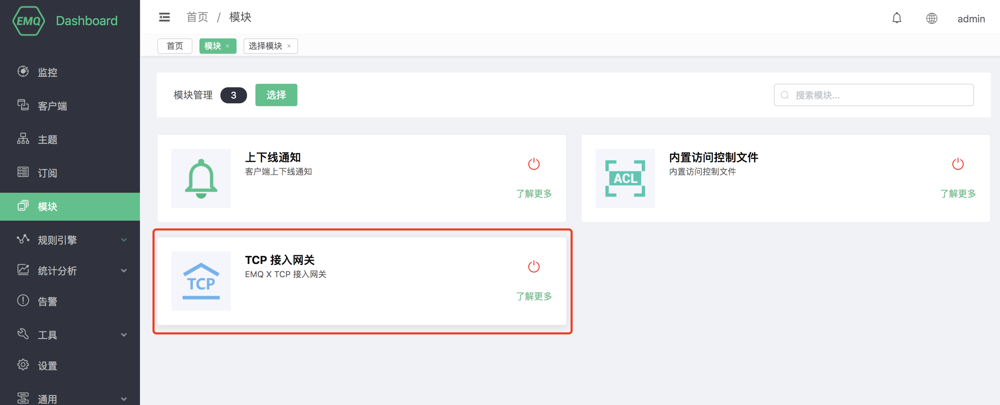

# TCP 接入网关

## 协议介绍

EMQ X 提供 **emqx-tcp** 模块作为一个靠近端侧的一个接入模块，按照其功能逻辑和整个系统的关系，将整个消息交换的过程可以分成三个部分：终端侧，平台侧和其它侧：

```bash
|<-- Terminal -->|<--------- Broker Side --------->|<---  Others  --->|
|<-    Sid e   ->|                                 |<--    Side    -->|

+---+                                                PUB  +-----------+
| D |  INCOMING  +----------+    PUB     +---------+   -->| subscriber|
| E |----------->|          |----------->|         |--/   +-----------+
| V |            | emqx-tcp |            |  EMQ X  |
| I |<-----------|          |<-----------|         |<--   +-----------+
| C |  OUTGOING  +----------+    PUB     +---------+   \--| publisher |
| E |                                                PUB  +-----------+
+---+
```

1. 终端侧，通过本模块定义的 TCP 私有协议进行接入，然后实现数据的上报，或者接收下行的消息。
2. 平台侧，主体是 emqx-tcp 模块和  EMQ X 系统。emqx-tcp 负责报文的编解码，代理订阅下行主题。实现将上行消息转为 EMQ X 系统中的 MQTT 消息 PUBLISH 到整个系统中；将下行的 MQTT 消息转化为 TCP 私有协议的报文结构，下发到终端。
3. 其它侧，可以对 2 中出现的上行的 PUBLISH 消息的主题进行订阅，以接收上行消息。或对发布消息到具体的下行的主题，以发送数据到终端侧。

## 创建模块

打开 [EMQ X Dashboard](http://127.0.0.1:18083/#/modules)，点击左侧的 “模块” 选项卡，选择添加：


选择 TCP 私有协议接入网关:


配置相关基础参数:


添加监听端口:


配置监听参数:


点击确认到配置参数页面:



点击添加后，模块添加完成: 

### 配置参数

| 配置项 | 说明 |
| :--- | :--- |
| 空闲超时时间 | 闲置时间。超过该时间未收到 CONNECT 帧, 将直接关闭该 TCP 连接 |
| 上行主题 | 上行主题。上行消息到 EMQ 系统中的消息主题%c: 接入客户端的 ClientId,%u: 接入客户端的 Username |
| 下行主题 | 下行主题。上行消息到 EMQ 系统中的消息主题%c: 接入客户端的 ClientId,%u: 接入客户端的 Username |
| 报文最大长度 | 最大处理的单个 TCP 私有协议报文大小 |
| 强制 GC 策略 | 强制 GC, 当进程已处理 1000 消息或发送数据超过 1M |
| 强制关闭策略 | 强制关闭连接, 当进程堆积 8000 消息或堆栈内存超过 800M |

